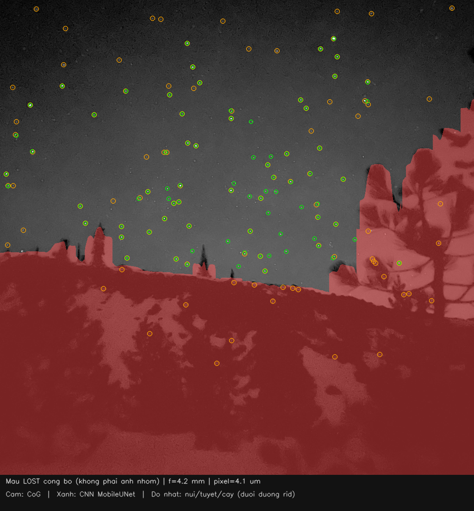
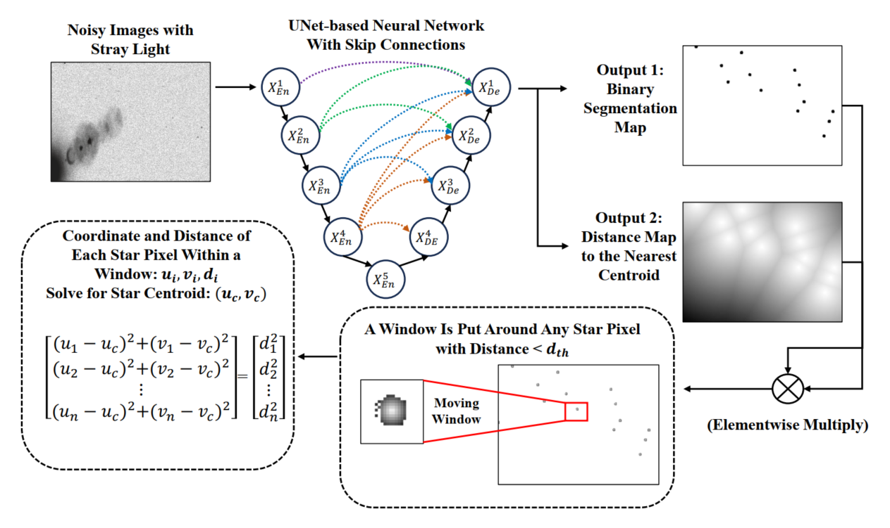
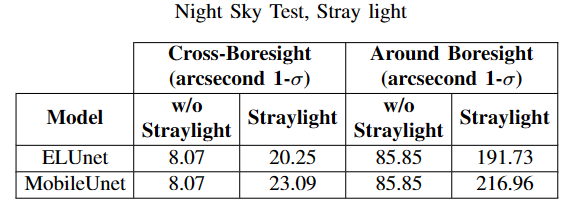
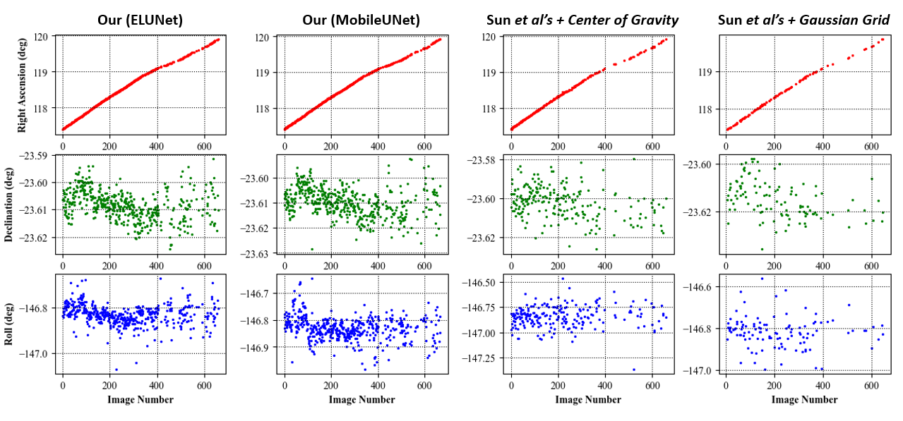

# HỒ SƠ DỰ ÁN DỰ THI BẢNG C
Cuộc thi Sáng tạo trẻ Quốc gia trong lĩnh vực Trí tuệ nhân tạo năm 2026

## Thông tin đội thi
- Số lượng thí sinh: 3 người (theo hồ sơ gốc)
- Thí sinh 1 (đội trưởng): Hoàng Trần Đức Hải — 08/11/2006 — 0852881106 — hoangtranduchai@gmail.com
  - Lớp 24T_Nhat1, Khoa Công nghệ thông tin, Trường Đại học Bách khoa, Đại học Đà Nẵng
  - Địa chỉ: Đường Khái Tây 6, Phường Ngũ Hành Sơn, thành phố Đà Nẵng
- Thí sinh 2: Nguyễn Tiến — 28/10/2006 — 0857674338 — nguyentien281006@gmail.com
  - Lớp 24T_Nhat1, Khoa Công nghệ thông tin, Trường Đại học Bách khoa, Đại học Đà Nẵng
  - Địa chỉ: 22/143 Phan Bội Châu, Phường Thuận Hóa, Thành Phố Huế
- Thí sinh 3: Mai Tạ Trúc Vy — 20/01/2006 — 0905702982 — maitatrucvy@gmail.com
  - Lớp 24T_DT1, Khoa Công nghệ thông tin, Trường Đại học Bách khoa, Đại học Đà Nẵng
  - Địa chỉ: 67 Nguyễn Sắc Kim, Phường Hòa Xuân, Thành phố Đà Nẵng
- GVHD: TS. Nguyễn Năng Hùng Vân (xác nhận người dùng; mẫu Bang C không có ô GVHD)
- Trường: Trường Đại học Bách khoa, Đại học Đà Nẵng
- Khoa: Khoa Công nghệ thông tin

## NỘI DUNG HỒ SƠ DỰ ÁN

### 1. Bài toán hoặc vấn đề thực tiễn cần giải quyết

Bài toán thực tiễn: từ ảnh bầu trời sao xác định hướng (attitude) của trục máy ảnh trong hệ J2000 khi không có tư thế ban đầu (lost-in-space). Ba bước: ước lượng tâm sao dưới mức một pixel; nhận dạng sao bằng hình học góc và catalog; giải Wahba ra quaternion. Lý do chọn: đầu ra gọn (4×float32 = 16 byte), phù hợp demo laptop cho sinh viên CNTT; đồng thời đối chiếu centroid cổ điển (CoG) với MobileUNet công khai (Zhao et al., arXiv:2404.19108) — không huấn luyện lại. Attitude là góc/hướng, không dùng GSD mét mặt đất. Điểm sáng tạo: (1) hệ lai CoG|CNN trên cùng pipeline Pyramid→Wahba; (2) so sánh công khai MobileUNet (Zhao et al.) không huấn luyện lại; (3) ca khó ảnh núi thật LOST — CoG tạo nhiều sao giả trên núi/cây, CNN gần như không (núi/cây CoG 25 vs CNN 1).

### 2. Mục tiêu, phạm vi và đối tượng ứng dụng của sản phẩm

Mục tiêu: (1) phát hiện và ước lượng tâm sao; (2) Pyramid/Mortari + K-vector trên Yale BSC5 (V ≤ 6); (3) quaternion J2000 16 byte (Wahba SVD/QUEST). Phạm vi: demo trên máy tính cá nhân. Camera demo: máy ảnh tĩnh APS-C khoảng 24 MP (6000×4000, pixel 3,72 µm, tiêu cự 50 mm, FOV ≈ 25,16°×16,93°). Bộ đo centroid: 1024×683 (pixel 21.796875 µm, f=50.0 mm) — tỷ lệ cạnh dài ~1024 cùng lớp FOV demo, không phải cảm biến bay mới. Không phải sản phẩm bay. Đơn vị: Trường Đại học Bách khoa, Đại học Đà Nẵng — Khoa Công nghệ thông tin.

### 3. Dữ liệu sử dụng, nguồn dữ liệu và tính hợp lệ của dữ liệu

Dữ liệu: (a) catalog Yale BSC5 công khai; (b) 500 ảnh giả lập sẵn trong data\sim_dataset\hd1024 (1024×683; lần đo này không sinh lại ảnh); (c) trọng số MobileUNet_B10_50.pt công khai, không huấn luyện lại; (d) ảnh thật công bố kèm LOST: data/uploads/mount_st_helens_1.png (4,2 mm / 4,1 µm); (e) hình minh họa từ trang dự án Zhao (chỉ trích dẫn). Không dùng dữ liệu cá nhân. Không sao chép số liệu từ hồ sơ nhóm khác.

### 4. Quy trình tiền xử lý, làm sạch, chuẩn hóa hoặc tổ chức dữ liệu

Tiền xử lý CoG: nền cục bộ, ngưỡng MAD, opening, connected components, trọng tâm cường độ. Nhánh CNN: chuẩn hóa mean/std theo tác giả; pad chia hết 32; segmentation + distance map; trilateration với ngưỡng bản đồ khoảng cách d_th=2.0 (đúng public run_neural_net). Catalog: bảng K-vector theo FOV đường chéo demo.

### 5. Thuật toán, mô hình, phương pháp hoặc công cụ trí tuệ nhân tạo được sử dụng

Mặc định không học máy: CoG → Pyramid/Mortari + K-vector → Wahba SVD/QUEST. Tùy chọn AI: MobileUNet công khai chỉ thay bước centroid (Zhao et al.). Công cụ: Python, NumPy, SciPy, OpenCV, PyTorch CUDA, pytest, app.py, demo_star_tracker.py. Trích dẫn Zhao et al., arXiv:2404.19108 (không phải số đo của nhóm): MobileUNet ≈ 0,020 s/khung trên RTX 2060M (Table V; thường nêu ~20 ms @ 640×480); MobileUNet trên Google Coral Edge TPU ≈ 266 ms (Table VI; số tác giả ≈ 265,5 ms); RMSE centroid tổng hợp MobileUNet ≈ 0,1695 px vs CoG ≈ 0,6966 px trên ảnh tổng hợp sạch (Table III). Hình minh họa nguồn tác giả: data/outputs/zhao_paper_figures/ (flowchart, stray-light night, attitude) — chú thích «Nguồn: Zhao et al., arXiv:2404.19108».

### 6. Quy trình huấn luyện, tinh chỉnh, tích hợp hoặc khai thác mô hình (nếu có)

Không huấn luyện lại CNN. Suy luận trên NVIDIA GeForce RTX 5070 Laptop GPU, cnn_torch_device=cuda, torch 2.11.0+cu128. Ngưỡng distance-map công khai = 2.0. Một lần chạy cục bộ trước đó dùng ngưỡng ~0,5√2 ≈ 0,707 (sai so với public run_neural_net) nên bị loại; số liệu trong file centroid_benchmark_hd1024.json cũ không được dùng cho hồ sơ. File đo lại: data/outputs/centroid_benchmark_hd1024_thr2.json.

### 7. Chỉ số, phương pháp hoặc tiêu chí đánh giá kết quả

Chỉ số: RMSE pixel so với ground-truth simulator (khớp ≤ 5 px); số sao khớp/GT; thời gian ms/khung và s/khung; trên ảnh núi thật — số điểm trên vùng núi/cây vs trời (mặt nạ heuristic); boresight RA/Dec so với LOST công bố (góc tách, độ). Attitude end-to-end (Δθ) trên bộ sim lớn: chưa kiểm được lần này.

### 8. Kết quả thử nghiệm, phân tích ưu điểm, hạn chế và khả năng mở rộng

BENCHMARK sim (thẩm quyền RMSE): 500 khung 1024×683, d_th=2.0, seed 7, file data/outputs/centroid_benchmark_hd1024_thr2.json. Thiết bị: NVIDIA GeForce RTX 5070 Laptop GPU. CoG: RMSE tb 0.1804 px · 34.23 ms tv; CNN: RMSE tb 0.4745 px · 60.17 ms tv. Trên bộ sạch này CoG thắng RMSE. Lóa mạnh 40 khung (centroid_benchmark_hd1024_glare_sun_strong.json): CoG RMSE tb 0.1449 px, CNN 0.3951 px — CNN không thắng RMSE trên bộ lóa này. Cổng sáng CNN tùy chọn «chỉ sao từ cấp 6 trở lên sáng» có trên web; trên một khung sim đã thử, cổng này không làm CNN thắng CoG — không overclaim. ĐIỂM SÁNG TẠO — ảnh núi thật công bố kèm LOST (không phải ảnh nhóm chụp): data/uploads/mount_st_helens_1.png, 1024×1024, 8-bit, tiêu cự 4,2 mm, pixel 4,1 µm, FOV ≈ 53°×53°. Overlay CoG (cam) vs CNN (xanh): data/outputs/mount_st_helens_cog_vs_cnn.png. Đếm trên mặt nạ núi/cây heuristic (chỉ dưới đường rid): CoG tổng 111 (núi/cây 25, trời 86); CNN tổng 79 (núi/cây 1, trời 78). Claim giữ một phần: CoG 25 điểm trên núi/cây vs CNN 1 (CoG trời 86, CNN trời 78). JSON: data/outputs/mount_st_helens_centroid_compare.json. Web preset «Ảnh núi thật» (đã khóa lần chạy gần nhất, sha array 62593b48bc0c): CNN ~5,1 s · 63/79 · RA 310,49° Dec +36,01°; CoG ~16,2 s · 64/106 · RA 310,52° Dec +35,95° — cả hai lệch LOST ≲ ~0,1° (LOST 310,446° / +36,0229°). CNN nhanh hơn trên ca này vì không «nhai» sao giả địa hình; không claim CNN luôn tốt hơn. Trên sim sạch CoG vẫn chính xác hơn (~0,446″ vs CNN ~1,65″). Attitude web vs LOST công bố (RA 310.446° · Dec +36.0229°): CNN RA 310.49° Dec +36.01° (Δ 0.038° vs LOST) · ID 63/79 · pipeline ~5.1 s · fallback=False; CoG RA 310.52° Dec +35.95° (Δ 0.094° vs LOST) · ID 64/106 · pipeline ~16.2 s · fallback=False. JSON: data/outputs/mount_st_helens_lost_compare.json. Hai file video minh chứng và URL git remote: chưa kiểm được — không bịa link. Trích dẫn Zhao et al., arXiv:2404.19108 (không phải số đo của nhóm): MobileUNet ≈ 0,020 s/khung trên RTX 2060M (Table V; thường nêu ~20 ms @ 640×480); MobileUNet trên Google Coral Edge TPU ≈ 266 ms (Table VI; số tác giả ≈ 265,5 ms); RMSE centroid tổng hợp MobileUNet ≈ 0,1695 px vs CoG ≈ 0,6966 px trên ảnh tổng hợp sạch (Table III). Hình minh họa nguồn tác giả: data/outputs/zhao_paper_figures/ (flowchart, stray-light night, attitude) — chú thích «Nguồn: Zhao et al., arXiv:2404.19108». Không claim CNN đã chứng minh bay.

### 9. So sánh với phương án hoặc mô hình cơ sở, phân tích đóng góp của các thành phần trong hệ thống (nếu có)

Baseline CoG. Trên 500 khung hd1024 (d_th=2.0): CNN không cải thiện RMSE (CoG 0.1804 px vs CNN 0.4745 px). Số bài báo (Table III/V/VI) chỉ là trích dẫn tác giả, tách khỏi bảng đo nhóm. Điểm sáng tạo: (1) hệ lai CoG|CNN trên cùng pipeline Pyramid→Wahba; (2) so sánh công khai MobileUNet (Zhao et al.) không huấn luyện lại; (3) ca khó ảnh núi thật LOST — CoG tạo nhiều sao giả trên núi/cây, CNN gần như không (núi/cây CoG 25 vs CNN 1). Đóng góp: tách CoG/CNN; giữ Pyramid/K-vector và Wahba; quaternion 16 byte; preset web «Ảnh núi thật».

### 10. Kiến trúc hệ thống và phương án triển khai

Kiến trúc: camera model → centroid (CoG | CNN) → Pyramid/K-vector → Wahba → quaternion 16 byte. Chạy: pip install -r requirements.txt; python demo_star_tracker.py --mode fast --seed 42 --lookup --no-show; python app.py (preset «Ảnh núi thật»). Slide: AI2026_SLIDE_THUYET_TRINH.pptx.

### 11. Phân tích rủi ro, yêu cầu bảo mật, đạo đức trí tuệ nhân tạo và an toàn dữ liệu

Rủi ro: nhận dạng sai → quaternion sai; radiometry assumption; trên ảnh sạch CNN lệch miền (RMSE cao hơn CoG). Mặt nạ núi/cây là heuristic — số đếm kèm overlay để kiểm chứng mắt. Không thu thập dữ liệu cá nhân. Demo laptop — không phải thiết bị bay.

### 12. Hướng phát triển, hoàn thiện và khả năng ứng dụng trong thực tiễn

Hướng tới: chuẩn hóa miền ảnh trên bộ sim; đo attitude end-to-end đầy đủ; mở rộng ảnh trời thật. Ứng dụng học tập tại Trường Đại học Bách khoa, Đại học Đà Nẵng — Khoa Công nghệ thông tin.

### 13. Lịch sử câu lệnh và hình ảnh minh chứng quá trình phát triển sản phẩm từ bản nháp đến khi hoàn thiện

Minh chứng: data/outputs/centroid_benchmark_hd1024_thr2.json; data/outputs/mount_st_helens_centroid_compare.json; data/outputs/mount_st_helens_lost_compare.json; data/outputs/mount_st_helens_cog_vs_cnn.png; data/uploads/mount_st_helens_1.png; data/outputs/zhao_paper_figures/; third_party/cnn_star_centroid/; src/centroid_cnn.py (d_th=2.0); AI2026_SLIDE_THUYET_TRINH.pptx. Google Drive lịch sử câu lệnh: chưa kiểm được. Hai file video minh chứng: chưa kiểm được (thiếu file). URL git remote: chưa kiểm được — không bịa link. Cấu trúc 13 mục Bang C đối chiếu PDF (tên file): ecoSim-Hồ-sơ-dự-án.pdf; Meetly-Hồ-sơ-dự-án.pdf; Signlang_Hồ-sơ-dự-án.pdf; Speakee-Hồ-sơ-dự-án.pdf; UniTrust-Hồ-sơ-dự-án.pdf; Viraldy-Hồ-sơ-dự-án.pdf.

## Hình minh chứng

### Demo nhóm — ảnh núi thật LOST (CoG cam vs CNN xanh)

*Chú thích: ảnh thật công bố kèm LOST, không phải ảnh của nhóm chụp; thông số 4,2 mm và 4,1 µm. Cam = CoG; xanh = CNN MobileUNet (d_th=2). Đỏ nhạt = mặt nạ núi/cây heuristic.*

- CoG: tổng 111 · núi/cây 25 · trời 86
- CNN: tổng 79 · núi/cây 1 · trời 78
- Kết luận: Claim giữ một phần: CoG 25 điểm trên núi/cây vs CNN 1 (CoG trời 86, CNN trời 78).
- Attitude web vs LOST công bố (RA 310.446° · Dec +36.0229°): CNN RA 310.49° Dec +36.01° (Δ 0.038° vs LOST) · ID 63/79 · pipeline ~5.1 s · fallback=False; CoG RA 310.52° Dec +35.95° (Δ 0.094° vs LOST) · ID 64/106 · pipeline ~16.2 s · fallback=False. JSON: data/outputs/mount_st_helens_lost_compare.json. Hai file video minh chứng và URL git remote: chưa kiểm được — không bịa link.

### Demo nhóm — khung sim hd1024 (1024×683)

*Chú thích: demo của nhóm, 1024×683 — không phải số liệu bài báo.*

### Nguồn Zhao et al., arXiv:2404.19108 (không phải đo của nhóm)

*Flowchart phương pháp — Nguồn: Zhao et al., arXiv:2404.19108*

*Night sky + stray light — Nguồn: Zhao et al., arXiv:2404.19108*

*Attitude so sánh — Nguồn: Zhao et al., arXiv:2404.19108*